# 在Rancher2.0中调度容器共享GPU

## 前言

K8s目前已支持通过容器请求的GPU资源来调度容器到相应的GPU节点中运行，该功能大量应用在通过k8s调度深度学习的场景中。  

K8s从1.8版本开始提供了device plugin framework机制进行节点上的设备管理。NVIDIA官方提供的k8s调度GPU的方案就是基于device plugin实现。但NVIDIA官方提供的GPU device plugin却有一个问题困扰着深度学习相关的开发者们，那就是**每一个实际的物理GPU只能调度给一个容器使用**，由于GPU资源相对昂贵，这样就在深度学习的开发调试过程中造成了很大的资源浪费。

下面就看看Rancher2.0如何在k8s中实现调度多容器共享物理GPU资源。

## 支持共享GPU的device plugin

通过阅读NVIDIA的GPU device plugin的[源码](https://github.com/NVIDIA/k8s-device-plugin)，可以看到NVIDIA的GPU device plugin实现方式如下：

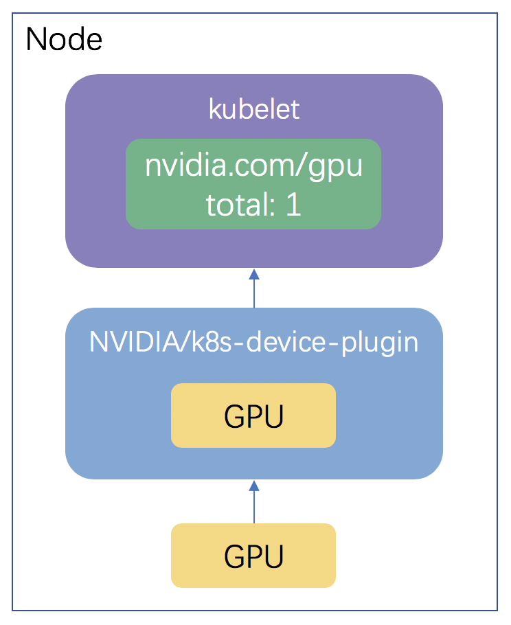

`k8s-device-plugin`部署在每个具有GPU的节点上，通过节点上安装的驱动获取到该节点具备的GPU资源信息并上报给kubelet。这样k8s就可以通过`k8s-device-plugin`上报的GPU资源信息进行容器的调度。在这里，每1个真实的物理GPU会对应的上报1个GPU资源给kubelet，而k8s在调度容器时，容器申请GPU资源的最小单位为1,这样就导致每个容器只能独占一个真实的物理GPU。

由于nvidia-docker本身就已支持多容器同时运行在一个物理GPU中，我们只需要修改NVIDIA官方的`k8s-device-plugin`，将一个真实的物理GPU映射为用户指定数量的虚拟GPU资源并上报给kubelet，这样k8s就可以调度对应数量的容器到该物理GPU中运行。

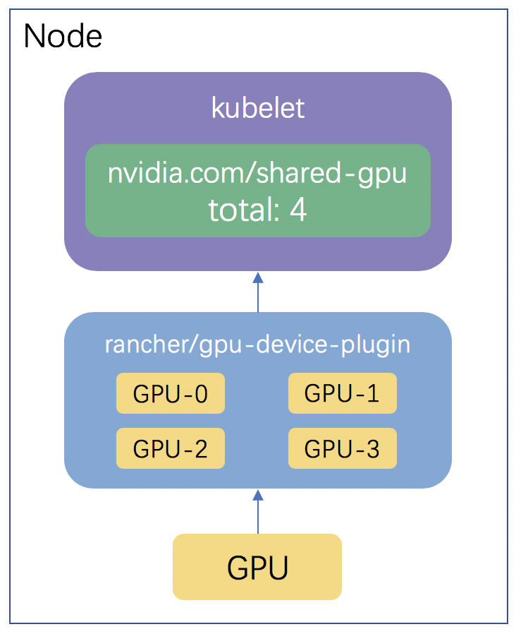

## 在Rancher2.0中管理GPU节点

在实现了共享GPU的device plugin基础上，Rancher2.0提供了便捷的方式对GPU device plugin进行部署以及对GPU节点进行管理，下面就动手试试如何在Rancher2.0中管理GPU节点。

- 首先我们在AWS上创建两个GPU的节点，在k8s中管理GPU节点要求的节点环境如下：
    - NVIDIA drivers ~= 361.93
    - nvidia-docker version > 2.0
    - docker configured with nvidia as the default runtime.
    - Kubernetes version >= 1.10

    这里我们直接使用AWS的Deep Learning AMI，其中已经包括了NVIDIA的驱动和nvidia docker。节点启动后编辑`/etc/docker/daemon.json`：
    ```
    {
        "default-runtime": "nvidia",
        "runtimes": {
            "nvidia": {
                "path": "/usr/bin/nvidia-container-runtime",
                "runtimeArgs": []
            }
        }
    }
    ```
    并重启docker服务，将docker的默认runtime修改为nvidia。

- 通过Rancher2.0创建一个k8s集群，将创建好的两个GPU节点作为worker加入到k8s集群中。

    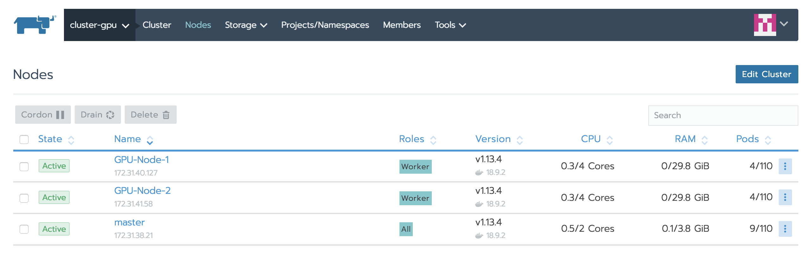

- 通过Rancher的catalog部署GPU device plugin

    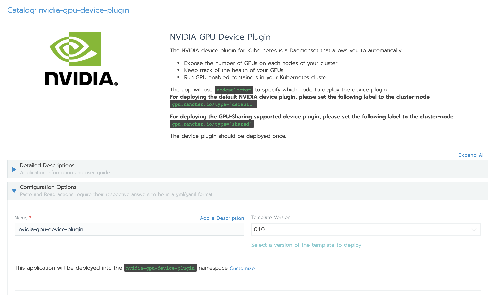

  在部署GPU device plugin时，我们可选择部署官方的GPU device plugin或可支持GPU Sharing功能的GPU device plugin

    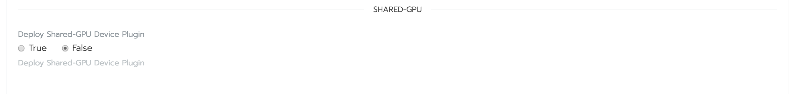
   
  部署支持GPU Sharing功能的GPU device plugin时，我们可以指定一个GPU最多同时可以运行的容器数量

    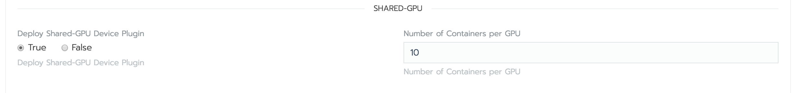

  这里我们分别部署两种类型的GPU device plugin用于同时管理不同类型的GPU节点。

    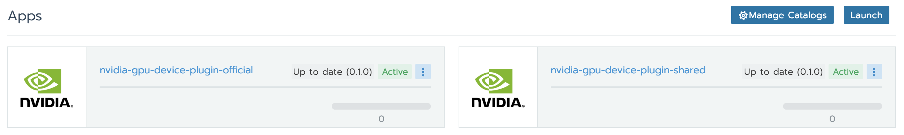

  可以看到catalog部署后并没有相应的Pod在节点中运行，GPU device plugin具体运行在集群的哪些节点中是通过NodeSelector进行调度的。我们只需要编辑GPU节点的label，添加由catalog定义好的label即可部署相应类型的GPU device plugin到节点中。
    - 通过Rancher的UI编辑GPU节点的label，这里将其中一个GPU节点设置为部署官方device plugin，另一个GPU节点设置为部署支持GPU Sharing的device plugin。

    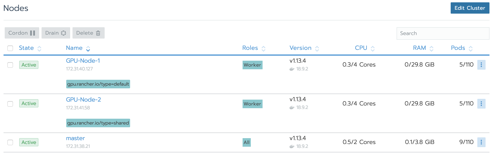

  相应节点的label设置成功后，对应的GPU device plugin的也成功调度到对应的节点中启动。

  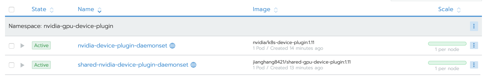

到这里我们就成功部署了两种类型的GPU device plugin，k8s已经具备了调度容器使用GPU资源的能力，接下来让我们看一看如何在Rancher中部署使用GPU资源的workloads。

## 在Rancher2.0中部署使用GPU资源的Workloads

k8s集群已经具备了调度容器使用GPU资源的能力，让我们试试如何在Rancher中部署Workloads时指定使用的GPU资源。

- 首先在部署Workload界面中选择`Show advanced options`选项

    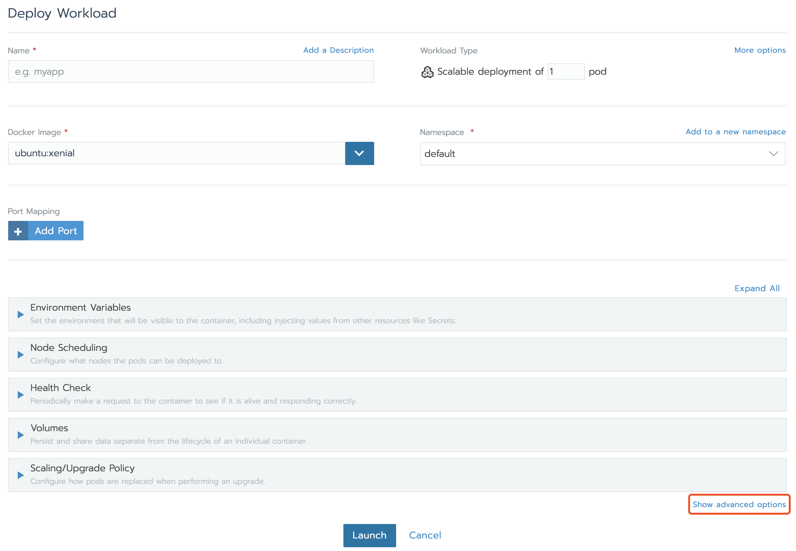

- 展开`Security & Host Config`设置项，可以看到`NVIDIA GPU Reservation`选项卡

    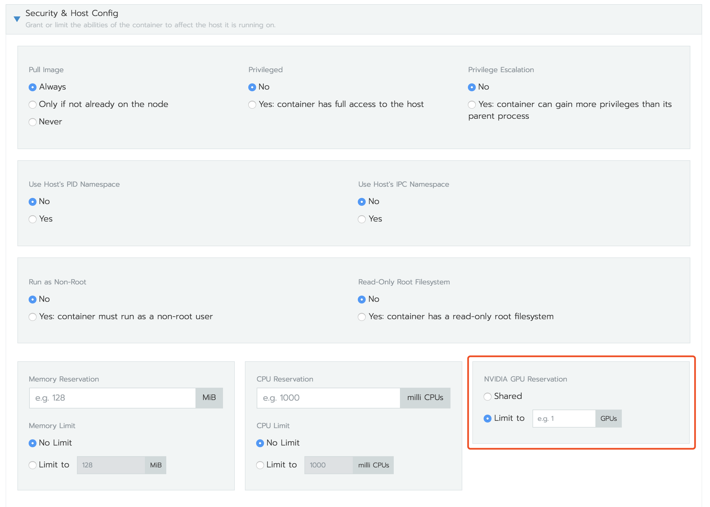

  - 勾选`Limit to`选项时，并填入相应的GPU资源数量，容器会调度到部署了NVIDIA官方device plugin的GPU节点中运行，同时该GPU节点需要具备对应设置数量的GPU资源。这时容器会独占GPU资源。
  - 勾选`Shared`选项时，容器会调度到支持GPU Sharing功能的GPU节点中运行，此时的容器运行将会与其他同样勾选了`Shared`选项的容器运行在同一个真实的物理GPU中。

- 我们部署一个使用GPU Sharing功能的workload，部署后该workload的容器会成功调度到相应的GPU节点中运行(在我们的测试环境中为GPU-Node-2)。

    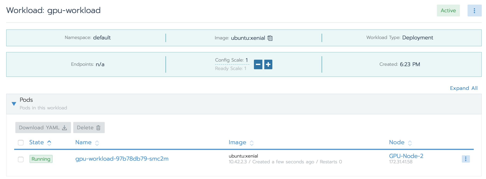

- 前面我们在部署支持GPU Sharing的device plugin时指定了同时运行在同一个GPU中最大的容器数量是5，这里我们Scale这个Workload的数量到5，可以看到相应的5个容器都会成功启动并运行在同一个GPU节点中。

    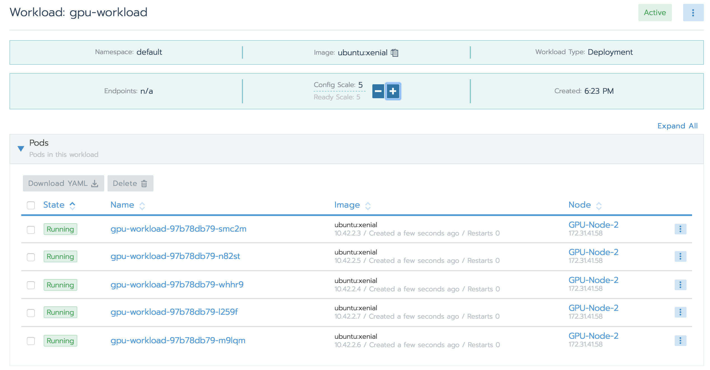

- 如果我们继续Scale这个Workload，接下来的Pod则会启动失败，失败的原因是没有足够的GPU资源。

    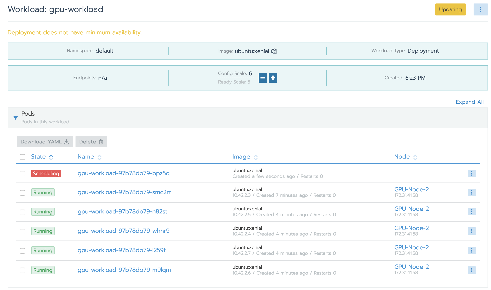

    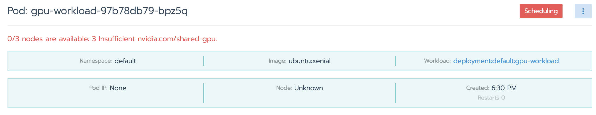

到这里我们成功在Rancher中实现了调度容器使用GPU资源以及多容器共享同一物理GPU资源。

## 不足之处

目前该方案虽然能够实现在k8s多容器共享同一个物理GPU资源，但由于并没有在真正意义上支持GPU的虚拟化，无法支持定量的GPU和内存资源分配，所以在使用时需要用户注意物理GPU的负载，避免发生内存溢出等问题。
